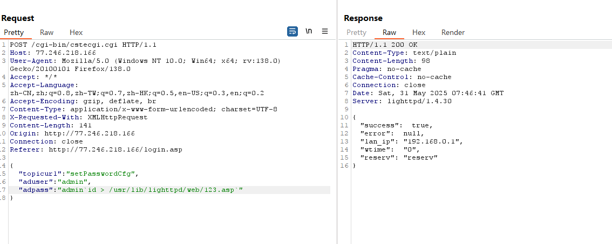
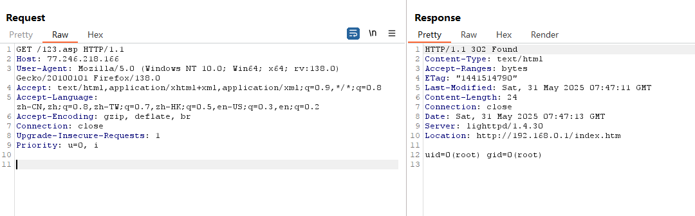

# TOTOLINK N300RH Command Injection Vulnerability

# TOTOLINK N300RH Command Injection Vulnerability

**Vulnerability Type:**  Command Injection (CWE‑78)

## Summary

**Title:**   
TOTOLINK N300RH Unauthenticated OS Command Injection via `system.so`​ `setPasswordCfg`​ `admpass` Parameter

**CVE ID:**   
To be assigned (no existing CVE found for this specific issue)

**Reporter:**   
a1ester  
Jinan University  
19558788851@163.com

**Vendor:**   
TOTOLINK

**Product:**   
TOTOLINK N300RH Wireless Router

**Impact:**   
Remote, unauthenticated OS command execution as root via the web management interface.

## Affected Products and Versions

**Confirmed affected model:**

- TOTOLINK N300RH

**Tested / observed vulnerable firmware versions:**

- V6.1c.1390_B20191101

**Firmware download page (for reference):**   
https://www.totolink.net/home/menu/detail/menu_listtpl/download/id/188/ids/36.html

> The vulnerability was verified on firmware version V6.1c.1390_B20191101.

**Product Description:**   
TOTOLINK N300RH is a wireless router from TOTOLINK designed for home and small office (SOHO) scenarios.

## Vulnerability Description

The vulnerability is located in the `setPasswordCfg`​ handler within `system.so`​. The web management interface retrieves the user-controlled `admpass` parameter and passes it directly into a command execution routine. This endpoint can be reached remotely without authentication and does not require user interaction.

The root cause is improper neutralization of externally supplied input before it is embedded into shell command strings. As stated in the vulnerability details, the `admpass` value (password) is directly concatenated into a system command for execution, allowing command injection via shell metacharacters.

## Technical Details

The `admpass`​ parameter is obtained from the HTTP request and spliced directly into an OS command executed by the system (via functions such as `CsteSystem()` or equivalent in the firmware). No sanitization or escaping is applied to the input.

This matches **CWE‑78: Improper Neutralization of Special Elements used in an OS Command ('OS Command Injection')** .

## Attack Scenario and Exploitability

### Preconditions

- The target device default expose the web management interface (typically `/cgi-bin/cstecgi.cgi`) over the network.
- No authentication or user interaction is required; a remote attacker can directly submit a crafted request to the vulnerable handler.

### Example Exploit (PoC)

A crafted POST request can be sent to the `setPasswordCfg`​ endpoint with a malicious `admpass`​ value containing shell metacharacters (e.g., `;`​, `|`​, `&`​) to inject arbitrary operating system commands.  
​

The vulnerability is rated **high severity** (高危) due to remote unauthenticated code execution.

‍
